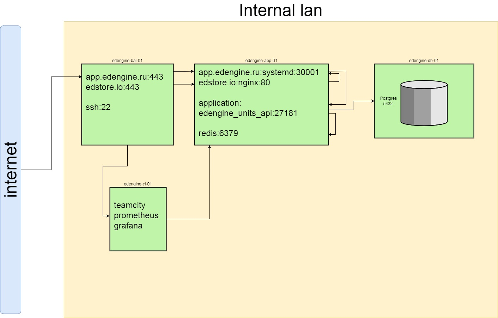

# Edengine

## Общие положения, описание архитектуры

Edengine - платформа для быстрого запуска образовательных программ в любой сфере (создание  и продажа онлайн-курсов)

Проект состоит из 2-х платформ, завязанных на backend сервис edengine_units_api
   * app.edengine.ru - плаформа для авторов, размещающих курсы
   * edstore.io  - маркетплейс: покупка курсов студентами
  - edengine_units_api - backend - сервис

Дополнительные ресурсы используемые в проекте:
  * postgresql - хранение данных (пароли, url`ы и т.д.)
  * s3 - хранение видеоконтента
  * redis-server - хранение токенов авторизации
  * nginx - веб-сервер
  * certbot - генерация ssl-сертификатов
  * python3.8 - для работы backend
  * npm - сборка фронта
  * git - получение кода из репозитория

## Установка и настройка серверов и сервисов проекта

### Установка балансера edengine-bal-01

  - создаем новый сервер edengine-bal-01, выполняем базовую настройку ОС
  - устанавливаем системные зависимости: `sudo apt install nginx certbot` 
  - в /etc/nginx/conf.d/ создаем файл app.edengine.ru.conf (пример файла в nginx_files/app.edengine.ru.conf)
  - в /etc/nginx/conf.d/ создаем файл edstore.io.conf (пример файла в nginx_files/edstore.io.conf)

### Установка сервера баз данных edengine-db-01

- создаем новый сервер edengine-db-01, выполняем базовую настройку ОС
- устанавливаем системные зависимости: `sudo apt install postgresql postgresql-contrib`
- в /etc/postgresql/12/main/pg_hba.conf прописываем директивы, разрешающие подключение с удаленных хостов по паролю:  
>  `host    edengine_units_api_db all      'ip сервера приложений'           md5`  
  `host    edengine_units_api_db all      'ip балансира'           md5` (добавляем если есть необходимость доступа к БД из-вне через ssh-тоннель)  
 - создаем пользователя бд edengine_units_api_admin: `create user edengine_units_api_admin with createdb encrypted password 'указать_пароль';`
 - создаем бд edengine_units_api_admin: `create database edengine_units_api_admin with owner edengine_units_api_admin;`

### Установка сервера приложений edengine-app-01

- создаем новый сервер edengine-app-01, выполняем базовую настройку ОС
- устанавливаем системные зависимости:  
  `sudo apt install npm git redis-server nginx`  
  `sudo apt install python3.8 python3.8-venv python3-dev build-essential libpq-dev`  
- настраиваем redis:  генерируем сложный пароль и 
< 
< 

